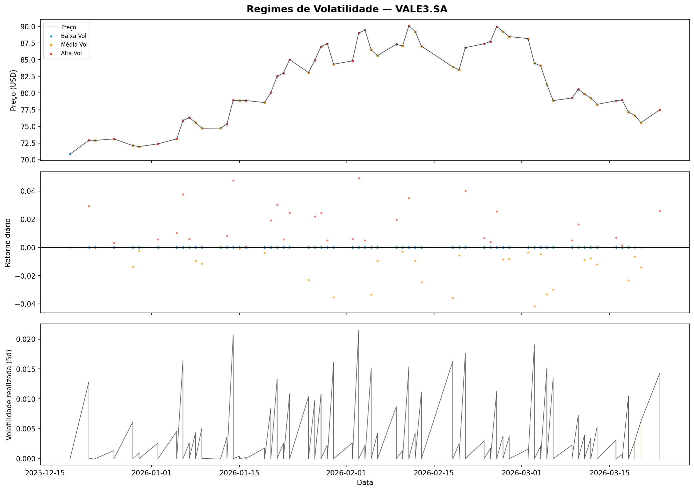
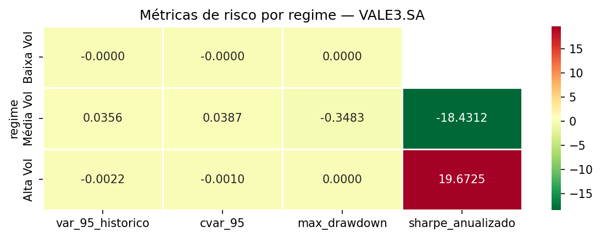
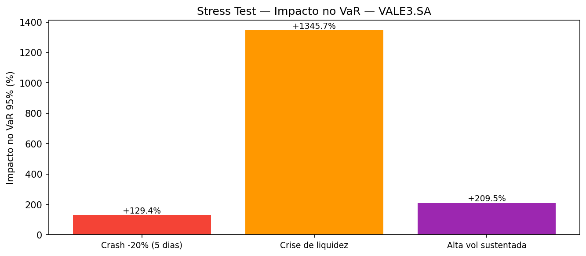

# Documentação Técnica: Motor análise de Regimes e Estresse (HMM-Risk)

## 1. Visão Geral
Este módulo implementa um framework de **Análise de risco não-linear**
que utiliza Modelos Ocultos de Markov (**Gaussian Hiden Markov Models**) 
para identificar regimes latentes de volatilidade constante, este motos reconhece que os mercados internos
alternam entre estados de "calma" e "pânico", ajustando
as métricas de capital (**VaR/CVar**) dinamicamente.

## 2. Componentes de Modelagem

### A. Segmentação por Gaussian HMM
O modelo utiliza uma abordagem não supervisionada para classificar o estado do mercado
- **Features de Entrada**: Vetor bidimensional $\mathbf{X} = [r_{log}, \sigma_{realized}]$,
onde  $r_{log}$ é o log-retorno e $\sigma_{realized}$ é a volatilidade móvel de 5 dias.
- **Ajuste (Fit)**: O algoritmo utiliza a técnica de Expectation-Maximization (EM) para maximizar a verossimilhança (Log-Likelihood)
- **Ordenação de Regimes**: Implementei uma reordenação automática baseada na média da volatilidade realizada, 
garantindo que o Regime 0 seja sempre "Baixa Vol" e o Regime N seja "Alta Vol", facilitando a interpretabilidade para o 
comitê de riscos.

### B. Métricas de riscos Quantitativas
O motor calcula o risco de cauda por regime.
- **Var histórico (95%)**: Percentual de perda máxima esperada sob condições normais
- **CVaR(Expected Shortfall)**: A média das perdas que excedem o VaR. Está é a métrica
preferencial para o ALM, pois quantifica o risco de catastrofe.
- **Sharpe Anualizado e Max Drawdown**: Indicadores de resiliência e eficiência de capital por estado.

### C. Framework de Stress Testing
O módulo de estresse aplica choques exógenos à série histórica para medir a sensibilidade do VaR:

- **Crash Sistêmico**: Simulação de queda de 20% em uma janela curta (5 dias).
- **Crise de Liquidez**: Choque de cauda longa (3 sigma) baseado na distribuição atual.
- **Volatilidade Sustentada**: Projeção de um cenário de incerteza prolongada.

## Visualização e Report
O sistema gera artefatos visuais para suporte à decisão (ALCO/Comitê de Riscos):

- **Regime Map**: Overlay colorido sobre o preço e volatilidade, permitindo identificar visualmente o histórico de transição de estados.
- **Heatmap de Risco**: Comparativo direto de métricas entre regimes (ideal para ver como o Sharpe degrada em regimes de alta vol).
- **Bar Chart de Impacto**: Visualização clara do incremento percentual no VaR sob estresse, essencial para definição de limites de exposição.

# Exemplo de Análise de Resultado
## Análise Estudo de caso (VALE3.SA)
Esta seção apresenta a interpretação macroeconômica e prudencial dos resultados gerados pelo motor de risco para o ativo VALE3.SA,
focando na aplicação prática para Gestão de Ativos e Passivos (ALM).

### 1. Mapeamento de regimes de validação
O gráfico abaixo ilustra a capacidade do modelo Gaussian HMM de segmentar
a série temporal de preços e volatilidade em três estados latentes distintos.

- **Regime 0 (Azul - Baixa Vol)**: Representa o estado de "normalidade" do mercado. É o regime predominante, onde o banco pode operar com spreads menores e menor exigência de capital de liquidez.
- **Regime 2 (Vermelho - Alta Vol)**: Identifica clusters de pânico e alta incerteza. Note como o modelo captura rapidamente os picos de volatilidade realizada (gráfico inferior).
- **Aplicação em ALM**: O banco deve utilizar este indicador como um Sinal de Alerta Precoce (Early Warning Signal). Ao detectar a transição para o Regime 2, o comitê de riscos deve considerar o aumento dos haircuts de garantia e a revisão dos limites de exposição intraday.

### 2. Heatmap de métricas de Risco por Estado
O heatmap quantifica a degradação dos indicadores de performance e o salto no risco de cauda à medida que o mercado transiciona de regime.

Interpretação dos Dados (VALE3):
- **Salto no CVaR 95%**: Observe como o CVaR (Expected Shortfall), nossa métrica preferencial para ALM, salta de valores próximos a zero no Regime 0 para um patamar de risco significativo no Regime 1 e 2. Isso indica que, se entrarmos no pior 5% dos cenários, a perda média será severa.
- **Max Drawdown**: O aumento exponencial do Max Drawdown nos regimes 1 e 2 confirma a necessidade de travas de stop-loss dinâmicas baseadas no regime atual.
- **Aplicação em ALM**: Este gráfico é fundamental para o cálculo do Capital Econômico. Ele prova que utilizar uma média histórica única de volatilidade subestima drasticamente o risco em períodos de estresse.

### 3. Impacto do Stress Test no Capital de Risco (VaR)
O gráfico de barras abaixo é o artefato final para a tomada de decisão prudencial. Ele mostra o quanto o nosso VaR Histórico (95%) base precisa ser "inflado" para cobrir cenários de crise.

Interpretação dos Cenários (VALE3):
- **Crise de Liquidez (+1385.19%)**: Este é o cenário mais crítico para a VALE3. O modelo indica que, em uma crise de liquidez sistêmica, o risco de perda máxima salta quase 14 vezes em relação à média histórica.
- **Crash -20% (+129.45%)**: Um crash repentino mais que dobra a exigência de capital de risco.
- **Aplicação em ALM**: Estes resultados devem alimentar diretamente o Plano de Contingência de Liquidez (LCP) do banco.

